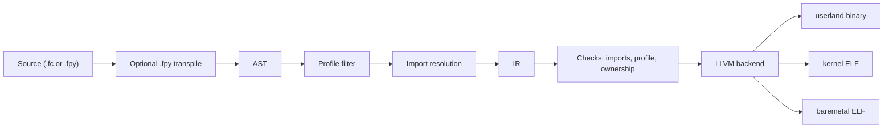

# Falcon Programming Language

I started Falcon because I wanted one language where I could write with Python-like ease, compile to native code, and still target user apps, kernels, and baremetal without changing the language every time the environment changed.

The core idea is simple:

> **Profiles define reality. The compiler enforces it.**

Falcon is an experimental systems programming language. The profile model is real. The compiler is real. The LLVM path is real. The rough edges are real too. I am not calling this production-ready yet, and I am not claiming Rust-level memory safety yet.

If you are here to try it, build it, or audit it, this README is meant to tell you exactly what Falcon is today.

## What Falcon Is

Falcon is trying to keep the same language across three execution realities:

- `userland`
- `kernel`
- `baremetal`

Instead of treating those as docs or flags you are expected to remember, Falcon makes them part of compilation.

That means:

- code that is valid in `userland` can be rejected in `kernel`
- imports are profile-aware
- runtime access is explicit
- the compiler does profile filtering before later stages continue

This is not "Python with a compiler backend," and it is not "Rust with lighter syntax." Falcon is its own experiment: **compile-time execution context as a language rule**.

## Try It Fast

### Prerequisites

- Rust and Cargo
- LLVM/Clang available on your machine
- Ollama installed locally if you want to try the AI demos

### Clone the repo

```bash
git clone <your-repo-url>
cd falcon
```

Replace `<your-repo-url>` with the actual GitHub repo URL once you publish it.

### Run Falcon from source without installing it globally

```bash
cd compiler
cargo run --features llvm --bin falcon -- ../examples/hello_world.fc
cargo run --features llvm --bin falcon -- ../examples/one_file_three_profiles.fc --profiles all
cargo run --features llvm --bin falcon -- ../examples/python_style/hello_world.fpy
```

### Install the `falcon` CLI globally

```bash
cd compiler
cargo install --path . --features llvm --bin falcon --force
```

After that you can run Falcon from the repo root:

```bash
falcon examples/hello_world.fc
falcon examples/one_file_three_profiles.fc --profiles all
falcon examples/python_style/hello_world.fpy
```

Windows helper:

```powershell
cd compiler
.\install-falcon.ps1 -Force
```

## Falcon At A Glance



That is the important part of Falcon for me: the selected profile is not a late runtime toggle. It shapes the compilation path all the way through.

## Why Falcon Feels Different

### 1. Profiles are compile-time laws

Falcon currently supports:

- `userland`
- `kernel`
- `baremetal`

Each profile has different allowed capabilities. Today:

- `userland` allows runtime, heap, threads, OS-facing helpers, and more
- `kernel` allows only the freestanding/unsafe side by default
- `baremetal` also allows only the freestanding/unsafe side by default

If a module or call needs capabilities the active profile does not allow, Falcon should reject it during compilation.

### 2. One source file can target all three

Falcon can compile one file into multiple realities by filtering the AST per profile before later stages continue.

```falcon
#[userland]
func main() -> i64 {
    let a = 21;
    let b = 21;
    return (a + b) * 2 - 84;
}

#[kernel]
func kernel_main() {
    let mut heartbeat = 0;
    loop {
        heartbeat = heartbeat + 1;
        if heartbeat > 1000000 {
            heartbeat = 0;
        }
    }
}

#[baremetal]
func _start() {
    let mut tick = 0;
    loop {
        tick = tick + 1;
        if tick > 1000000 {
            tick = 0;
        }
    }
}
```

```bash
falcon examples/one_file_three_profiles.fc --profiles all
```

That does not compile once and sprinkle flags later. Falcon runs the pipeline separately for each chosen profile.

On Windows, the outputs are profile-suffixed:

- `one_file_three_profiles.userland.exe`
- `one_file_three_profiles.kernel.elf`
- `one_file_three_profiles.baremetal.elf`

### 3. AST first, IR after that

Falcon uses both because they serve different jobs.

The AST is useful for:

- parsing
- profile filtering
- import resolution
- source-oriented validation

The IR is where Falcon makes execution rules more explicit before codegen:

- lowered operations
- profile checks
- import contract checks
- ownership-related verification
- backend handoff

The current pipeline is:

```text
Source
  -> optional .fpy transpile
  -> lexer
  -> parser
  -> AST
  -> profile filter
  -> import resolution
  -> trait / generic passes
  -> IR lowering
  -> import + profile + ownership checks
  -> LLVM backend
  -> native output
```

## `.fpy`: Python-Style Falcon

Falcon also supports `.fpy`, which is a Python-style front end for Falcon source.

Example:

```python
import string

def main():
    println("Hello, World!")
```

Both styles aim at the same compiler pipeline and the same IR.

What happens internally:

1. Falcon detects the `.fpy` extension.
2. It transpiles the file to `something.__gen__.fc`.
3. The normal Falcon compiler pipeline continues from that generated file.
4. The generated file is deleted unless you pass `--keep-generated`.

```bash
falcon examples/python_style/hello_world.fpy
falcon build examples/python_style/hello_world.fpy --keep-generated
```

Important limit:

- `.fpy` is **userland-only**

This is about Python-like ergonomics for native Falcon code. It is **not** CPython compatibility and it does **not** mean arbitrary Python packages will run unchanged.

## Imports And Library Model

Falcon tries to keep runtime access explicit.

You import modules directly:

```falcon
import string;
import random;
import ai;
```

In `userland`, routed imports like `import string;` resolve to the userland-facing module surface.

In `kernel` and `baremetal`, those same userland imports are rejected and you are expected to use a profile-safe path such as `::raw` where appropriate.

Falcon currently checks imports in multiple places:

- source-level import validation
- import resolution and cycle detection
- missing-import linting for runtime symbols
- an IR import contract that rejects backend fallback magic

That means a call like `println(...)` is supposed to come from an explicit import, not because the backend silently guessed what you meant.

The library story right now looks like this:

- `library/` contains real Falcon bindings over runtime symbols in `compiler/runtime/`
- `stdlib/` is broader and more exploratory, and not all of it is equally mature yet

Current implemented binding modules include:

- `math`
- `io`
- `random`
- `string`
- `ai`

Some APIs intentionally borrow Python-style ergonomics where it makes sense, especially around `random`, but they are Falcon-native bindings. Falcon is not shipping the CPython runtime inside this repo.

## Falcon + Ollama

One of the most fun userland demos in the repo is Falcon talking to a local Ollama model from native code.

Example file:

- `examples/llm_ollama.fc`

```falcon
// llm_ollama.fc - Real Ollama LLM Integration Demo
// Compile with: falcon build examples/llm_ollama.fc --run
//
// This talks to your local Ollama install.
// If needed, start Ollama with: ollama serve
import string;
import ai;

func main() {
    println("=== Falcon + Ollama LLM Demo ===");
    println("");

    println("Asking phi3:mini to explain Falcon...");
    println("");

    generate("phi3:mini", "What is a falcon? Answer in 2 sentences.");

    println("");
    println("Demo complete!");
}
```

What the `ai` module currently does:

- exposes Falcon functions like `generate(...)` and `chat(...)`
- routes them to native runtime hooks
- those hooks invoke your local `ollama` command from userland

### Run it yourself

1. Install Ollama locally
2. Pull a model:

```bash
ollama pull phi3:mini
```

3. If your Ollama install is not already running, start it:

```bash
ollama serve
```

4. Run the Falcon demo

If you installed the `falcon` CLI globally:

```bash
falcon build examples/llm_ollama.fc --run
```

If you are running Falcon from source inside this repo:

```bash
cd compiler
cargo run --features llvm --bin falcon -- build ../examples/llm_ollama.fc --run
```

If `ollama` is not on your `PATH`, Falcon also supports setting `FALCON_OLLAMA_CMD` to the executable path.

This part is intentionally userland-only. Kernel and baremetal profiles do not get hosted AI/process helpers.

### Screenshot

Add your terminal screenshot here to show Falcon compiling a native userland program that imports `ai` and talks to a local Ollama model.

## Honest Status

I want the repo to be clear about where Falcon is strong already and where it is still behind.

| Area | Where Falcon stands today |
| --- | --- |
| Profile model | Real and already enforced in the compiler |
| One-file multi-profile builds | Real |
| LLVM backend | Main backend and the serious compilation target |
| `.fpy` front end | Real, but userland-only |
| Import contract | Real and important to the design |
| Ownership / borrow checking | Partial |
| Memory safety story | Improving, but not Rust-complete |
| Generics | Real, but still maturing |
| Capturing closures | Not finished |
| C backend | Legacy/debug-oriented, not the main target |
| Library / stdlib surface | Useful, but ahead of some guarantees underneath |
| Repo polish | Still needs cleanup in places |

### What I am not claiming yet

I am not claiming:

- full Rust-grade memory safety
- finished lifetime analysis
- a complete standard library
- production-readiness across all language features

The honest positioning for Falcon right now is:

> **An experimental systems language exploring compile-time execution profiles for userland, kernel, and baremetal targets.**

I think that is already interesting enough on its own.

## Repository Map

- `compiler/` - main compiler and CLI
- `compiler/runtime/` - profile-specific runtime sources
- `library/` - Falcon-native bindings over runtime functionality
- `stdlib/` - broader standard-library direction, still partial
- `examples/` - example programs
- `examples/python_style/` - Python-style Falcon examples
- `tools/fpy_transpiler/` - `.fpy` front end transpiler

## Documentation

- [Design Principles](DESIGN_PRINCIPLES.md)
- [Memory Model](MEMORY_MODEL.md)
- [Ownership Rules](OWNERSHIP_RULES.md)
- [IR Ownership Spec](IR_OWNERSHIP_SPEC.md)
- [Import System Spec](IMPORT_SYSTEM_SPEC.md)
- [Unsafe Guarantees](UNSAFE_GUARANTEES.md)
- [Kernel Scope](KERNEL_SCOPE.md)
- [What Falcon Will Never Do](WHAT_FALCON_WILL_NEVER_DO.md)
- [Contributing](CONTRIBUTING.md)
- [Library Binding System](library/README.md)

## License

[MIT](LICENSE)
