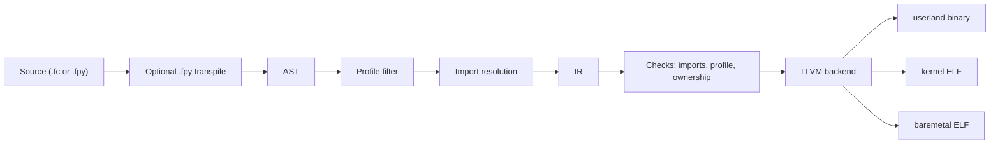

# Falcon Programming Language

Falcon is an experimental systems programming language built around one central idea:

> Profiles define reality. The compiler enforces it.

Falcon uses one language surface across three execution environments:

- `userland`
- `kernel`
- `baremetal`

The project is early, but the compiler, profile model, LLVM path, and import contract are real. The repository is published as an honest alpha, not as a finished production language.

## Overview

Falcon is designed around a few constraints:

- execution context is a compile-time property, not a runtime switch
- imports are explicit and profile-aware
- AST is used for source-oriented analysis and filtering
- IR is used as the semantic handoff to verification and code generation
- the same language can target hosted and freestanding builds

Falcon is not positioned as "Python compiled directly" and it is not marketed as "Rust-level memory safety today." It is a systems-language experiment with a serious compiler core and several unfinished subsystems.

## Quick Start

### Clone the repository

```bash
git clone https://github.com/jhonpork1233-beep/FALCON.git
cd FALCON
```

### Build and run from source

```bash
cd compiler
cargo run --features llvm --bin falcon -- ../examples/hello_world.fc
cargo run --features llvm --bin falcon -- ../examples/one_file_three_profiles.fc --profiles all
cargo run --features llvm --bin falcon -- ../examples/python_style/hello_world.fpy
```

### Install the CLI

```bash
cd compiler
cargo install --path . --features llvm --bin falcon --force
```

Then run Falcon from the repository root:

```bash
falcon examples/hello_world.fc
falcon examples/one_file_three_profiles.fc --profiles all
falcon examples/python_style/hello_world.fpy
```

Windows helper:

```powershell
cd compiler
.\install-falcon.ps1 -Force
```

## Compiler Pipeline



Falcon uses both AST and IR on purpose:

- the AST keeps source structure available for profile filtering, import resolution, and source-level validation
- the IR is the semantic handoff for profile checks, ownership-related verification, and backend lowering

## Profiles

| Profile | Intended use | Runtime | Hosted I/O | Heap |
| --- | --- | --- | --- | --- |
| `userland` | native applications and tools | yes | yes | yes |
| `kernel` | freestanding components and low-level services | no hosted runtime | rejected | rejected by default |
| `baremetal` | firmware and direct hardware control | no hosted runtime | rejected | rejected by default |

Direct file mode defaults to `userland`.

Freestanding builds require explicit entrypoints and profile-safe imports. The compiler rejects many hosted facilities in `kernel` and `baremetal` builds.

## One File, Three Profiles

Falcon can compile one file multiple times with different profile filters applied before later stages continue.

```falcon
#[userland]
func main() -> i64 {
    let a = 21;
    let b = 21;
    return (a + b) * 2 - 84;
}

#[kernel]
func kernel_main() {
    let mut heartbeat = 0;
    loop {
        heartbeat = heartbeat + 1;
        if heartbeat > 1000000 {
            heartbeat = 0;
        }
    }
}

#[baremetal]
func _start() {
    let mut tick = 0;
    loop {
        tick = tick + 1;
        if tick > 1000000 {
            tick = 0;
        }
    }
}
```

```bash
falcon examples/one_file_three_profiles.fc --profiles all
```

On Windows, outputs are profile-suffixed, for example:

- `one_file_three_profiles.userland.exe`
- `one_file_three_profiles.kernel.elf`
- `one_file_three_profiles.baremetal.elf`

## Python-Style Falcon

Falcon supports `.fpy` as a Python-style front end for userland programs.

```python
import string

def main():
    println("Hello, World!")
```

Build it the same way:

```bash
falcon examples/python_style/hello_world.fpy
falcon build examples/python_style/hello_world.fpy --keep-generated
```

The compiler:

1. detects the `.fpy` extension
2. transpiles the file to `something.__gen__.fc`
3. continues through the standard Falcon pipeline

Important limit:

- `.fpy` is currently `userland`-only

This is a Falcon syntax front end, not CPython compatibility.

## Import System

Falcon keeps runtime access explicit.

```falcon
import string;
import random;
import ai;
```

Imports are profile-aware:

- in `userland`, routed modules such as `string` resolve to their userland surface
- in `kernel` and `baremetal`, the same import is rejected unless a profile-safe path is used
- runtime-backed symbols are expected to come from explicit imports rather than backend fallback

Useful commands:

```bash
falcon check examples/hello_world.fc --dump-imports
falcon build examples/hello_world.fc --strict-imports
```

## Falcon and Ollama

Falcon includes a userland `ai` binding layer that can invoke a local Ollama installation.

Example file:

- `examples/llm_ollama.fc`

```falcon
import string;
import ai;

func main() {
    println("=== Falcon + Ollama LLM Demo ===");
    println("");

    println("Asking phi3:mini to explain Falcon...");
    println("");

    generate("phi3:mini", "What is a falcon? Answer in 2 sentences.");

    println("");
    println("Demo complete!");
}
```

Run it:

```bash
ollama pull phi3:mini
ollama serve
falcon build examples/llm_ollama.fc --run
```

If `ollama` is not on `PATH`, set `FALCON_OLLAMA_CMD` to the executable path.

### Screenshot

Add a terminal screenshot here showing Falcon compiling a native userland program that imports `ai` and talks to a local Ollama model.

## Project Status

Falcon should currently be described as:

> An experimental systems language exploring compile-time execution profiles for userland, kernel, and baremetal targets.

The repository already contains a real compiler, runtime sources, examples, and profile-aware validation. It also still has important gaps:

- ownership and memory guarantees are not yet Rust-complete
- generics are implemented but still maturing
- captured closures are not finished
- the `stdlib/` tree is broader than the currently stable implementation surface
- the C backend is legacy/debug-oriented; LLVM is the primary path

## Repository Layout

- `compiler/` - compiler, CLI, runtime sources, tests
- `examples/` - Falcon examples, including profile demos and `.fpy` examples
- `library/` - runtime-backed Falcon modules
- `stdlib/` - broader, still-evolving standard-library direction
- `tools/fpy_transpiler/` - `.fpy` front end
- `docs/` - supporting technical documentation

## Documentation

- [Falcon Language Reference](FALCON_LANGUAGE.md)
- [Current Capabilities](CURRENT_CAPABILITIES.md)
- [Design Principles](DESIGN_PRINCIPLES.md)
- [Memory Model](MEMORY_MODEL.md)
- [Ownership Rules](OWNERSHIP_RULES.md)
- [Import System Specification](IMPORT_SYSTEM_SPEC.md)
- [IR Ownership Specification](IR_OWNERSHIP_SPEC.md)
- [Unsafe Guarantees](UNSAFE_GUARANTEES.md)
- [Kernel Scope](KERNEL_SCOPE.md)
- [Repository Overview](WHAT_WE_BUILT.md)
- [Library README](library/README.md)
- [Standard Library README](stdlib/README.md)

## License

[MIT](LICENSE)
